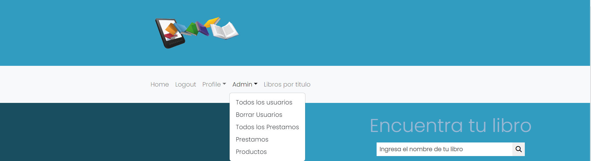

# Frontend_Proyecto_Final-E_Books
<em> # Bienvenido a la aplicación Frontend Api E_books</em>


### Datos generales

**- Autor del proyecto:** Corina Maria Ciorpac.

**- Título del proyecto:** Proyecto Final - Frontend App E_BOOKS

**- Fecha:** 7/5/2023


 <p align="left">
   
   </p>

<details>
  <summary>Índice</summary>
  <ol>
    <li><a href="#Sobre-este-proyecto">Sobre este proyecto</a></li>
    <li><a href="#Implementación-local ">Implementación Local</a></li>
    <li><a href="#Tecnologías">Tecnologías</a></li>
    <li><a href="#Instalación local">Instalación local</a></li>
    <li><a href="#Cómo-se-ha-realizado-este-proyecto">¿Cómo se ha realizado este proyecto?</a></li>
    <li><a href="#Vista-Api">Vista Api</a></li>
     <li><a href="#Funcionalidades-Api">Futuras funcionalidades </a></li>
    <li><a href="#Licencia">Licencia</a></li>
    <li><a href="#Webgrafia">Webgrafia</a></li>
    <li><a href="#Agradecimientos">Agradecimientos</a></li>
    <li><a href="#Contacto">Contacto</a></li>
  </ol>
</details>

## Sobre este proyecto 🎯

<p align="center"></p>

<p align="center">El proyecto consiste en desarrollar la API Book_Friends un club de lectores virtual, centrado en el préstamo de e-books y audiolibros. La plataforma permitirá a los usuarios registrarse, acceder y participar en un espacio digital para descubrir, compartir y disfrutar de una amplia variedad de contenidos literarios .</p>

## Implementación 🚀
<div align="center">
    <a href=""><strong>URL de producción</strong></a>🚀🚀🚀
</div>

## Tecnologías
<div align="center">
<a href="https://www.reactjs.com/">
    
</a>
<a href="https://developer.mozilla.org/es/docs/Web/JavaScript">
    
</a>
 <a href="https://redux.js.org/">
    
</a>
<a href="https://react-bootstrap.github.io/">
    
</a>
<a href="https://nodejs.org/en">
    
</a>
<a href="https://github.com/">
    
</a>
<a href="https://git-scm.com/downloads">
    
</a>
<a href="https://aws.amazon.com/es/">
    
</a>
<a href="https://developer.mozilla.org/es/docs/Web/CSS">
    
</a>
<a href="https://developer.mozilla.org/es/docs/Web/CSS">
    
</a>
<a href="https://nextjs.org/">
    
</a>
<a href="https://expressjs.com/">
    
</a>
<a href="https://www.sequelize.org/">
    
</a>
<a href="https://www.npmjs.com/">
    
</a>


## Implementación local


 #Clone the project on your computer
    ` $ git clone 'url-repository' `


 #Install all dependencies
    ` $ npm install `
 
 
 #Create a .env with the credentials on the .env.example


  #Start server with:
    ``` $ npm run dev ```


 #Connect with the database following:
    ``` $ npx sequelize-cli db:create ```
    ``` $ npx sequelize-cli db:migrate ```
    ``` $ npx sequelize-cli db:seed:all ```


#Now is time for frontend project:


 #Clone the project on your computer
    ``` $ git clone 'url-repository ``` 


 #Install all dependencies
    ``` $ npm i ```
 
 #Start server with:
   ``` $ npm run dev ```


#Last step download the dataBase:


[Data base git hub](https://github.com/corina43/Frontend_Proyecto_Final-E_Books-E_BOOKS)


## ¿Cómo se ha realizado este proyecto?


Primero, se clonó el proyecto desde un repositorio remoto de Git y se instaló localmente. Luego, se instalaron todas las dependencias necesarias a través de npm.

Posteriormente, se configuraron los archivos de configuración para permitir la comunicación con el servidor backend, utilizando la biblioteca de JavaScript axios para simplificar la comunicación HTTP.

A continuación, se trabajó en el diseño de la interfaz de usuario, utilizando Bootstrap React como marco de trabajo. Además, se agregaron algunos componentes personalizados y se diseñó el esquema de colores y estilos.

### Acceso a la aplicación


Datos de acceso como administrador: 

> Mail: corina@example.com // Password: corina123

Datos de acceso como usuario: 

> Mail: alyna@example.com // Password: alyna123


### Vista Api
---


---
### FRONTEND
 
 
 
### PANTALLAS Y PÁGINAS DE LA APLICACIÓN

La aplicación permite la navegación entre las distintas pantallas que la componen. Está estructurada de la siguiente manera:
 
 
### Vista usuario no registrado


> ### Home
> La vista "Home" es la página principal de la aplicación. Proporciona una funcionalidad de búsqueda de libros utilizando la API de Google Books,los usuarios pueden ingresar el nombre de un libro que deseen buscar. Al presionar la tecla "Enter", se realiza una solicitud a la API de Google Books para buscar libros que coincidan con el término de búsqueda ingresado.Los resultados de la búsqueda se muestran en forma de tarjetas de libros. Cada tarjeta contiene información relevante sobre el libro, como el título, autor, descripción y una imagen de portada
> ### Login
> ### Register

### Vista usuario registrado(se accede mediante login)


   >* Logout: cerrar session
   >* Profile: permite ver la informacion de cada usuario 
   >* Profile Update: permite actualizar la informacion
   >* ### miInformacion:
  * Mis prestamos: prestamos de cada usuario
  * Productos: visualizar todos los libros existentes en la base de datos mediante cards con la imagen,descripcion,autor,titulo...

   >* Crear Prestamos: realizar prestamos sobre los productos existentes en la base de datos.
   >* Libros por titulo: busqueda por titulo de los libros existentes en la base de datos

  ### Vista usuario admin

   

   >* Logout: cerrar session
   >* Profile: permite ver la informacion de cada usuario 
   >* Profile Update: permite actualizar la informacion
   >* ### Admin
   * Todos los usuarios: muestra la informacion de todos los usuarios
   * Borrar usuarios: permite borrar un usuario mediante la introduccion del id de usuario
   * Todos los prestamos: muestra la informacion de todos los prestamos
   * Productos: muestra todos los libros existentes en la base de datos mediante cards con la imagen,descripcion,autor,titulo...
   >* Libros por titulo: busqueda por titulo de los libros existentes en la base de datos

   ## Bugs conocidos


⬜ Desajustes en el register se crea el usuario en la base de datos,pero no se encripta el password y por lo consequiente no se hace.

⬜ No aparece el nombre del usuario logeado en el NavBar,aparece el email.

⬜ Problemas al actualizar el perfil.  

⬜ Borrar usuarios no se realiza adecuadamente. 

⬜ No todas las vistas son responsive.

## Webgrafia:


To achieve the goal we have collected information from:
  [React documentation](https://www.reactjs.com/)

  [React-bootstrap GeeksHubs](https://react-bootstrap.github.io/)


## Agradecimientos:

Agradezco a todos mis compañeros y especialmente a:

  **Dani** 

<a href="https://www.github.com/datata" target="_blank"></a> 

  **Jose**

<a href="https://github.com/JoseMarin" target="_blank"></a> 

  **Mara**

<a href="https://www.github.com/MaraScampini" target="_blank"></a> 

  **Alvaro**

<a href="https://www.github.com/Alvaro" target="_blank"></a>


## Contacto

<a href = "mailto:micorreoelectronico@gmail.com"></a>
<a href="https://www.linkedin.com/in/linkedinUser/" target="_blank"></a> 
</p>